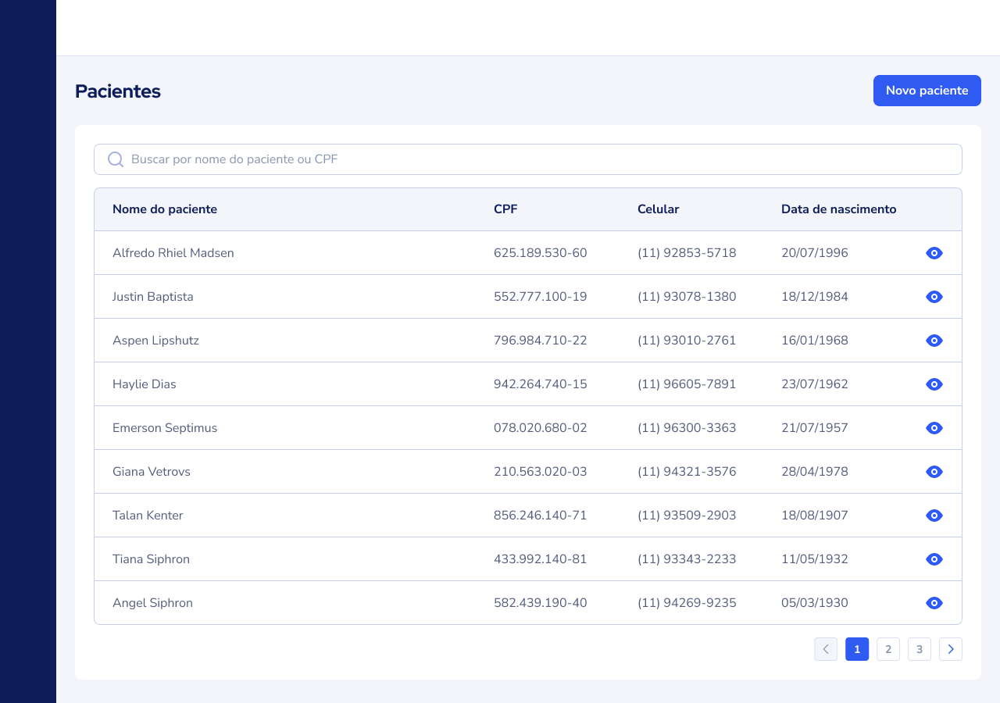

# Desafio para a vaga de Fullstack Developer (PHP/Laravel e VueJS)

## Instruções
- O desafio consiste em criar uma pequena aplicação fullstack com o Backend em PHP/Laravel e o Front-end (client) em VueJS.
- A aplicação precisará entregar uma aplicação com o CRUD completo para o cadastro de pacientes.
- A ideia é avaliar habilidades como técnica e lógica de programação, estilo de código e padronização do trabalho.

### Entrega Esperada
- README com instruções de como rodar as duas aplicações juntas
- Tela inicial com listagem de pacientes
- Tela de detalhe do paciente com infos sobre o paciente
- Tela de edição de paciente
- Modal de confirmação de exclusão de um paciente
-  Ao excluir, o sistema deverá realizar um "soft delete" do registro na base
- Utilizar boas práticas de programação e código limpo

## Informações Úteis
- O candidato deverá clonar o repositório de back-end e do front-end, rodar as duas aplicações localmente e criar o trabalho proposto no desafio.

### Back-end (php-laravel)
- No docker-compose do projeto já tem instância de MySQL e a aplicação conteinerizada
- Utilizar API Rest para expor as rotas para o front-end
- Anexar um arquivo do Postman com exemplos das chamadas
- Entrega com testes de unidade ou E2E serão usadas como critério de desempate.

### Front-end (front-vuejs)
- Utilizamos VueJS 2 criados a partir do "Getting Start" da documentação
- Criar rota e layout utilizando Vue-Material, Vue-Bootstrap ou Vuetify (ou outra lib de sua escolha)
- Criar uma página para listar os pacientes
- Botões e interações na listagem para entrar no detalhe do paciente, editar ou excluir um paciente
- Tela de Detalhes do paciente

### Tela / Protótipo
Todas as telas estão na pasta images

